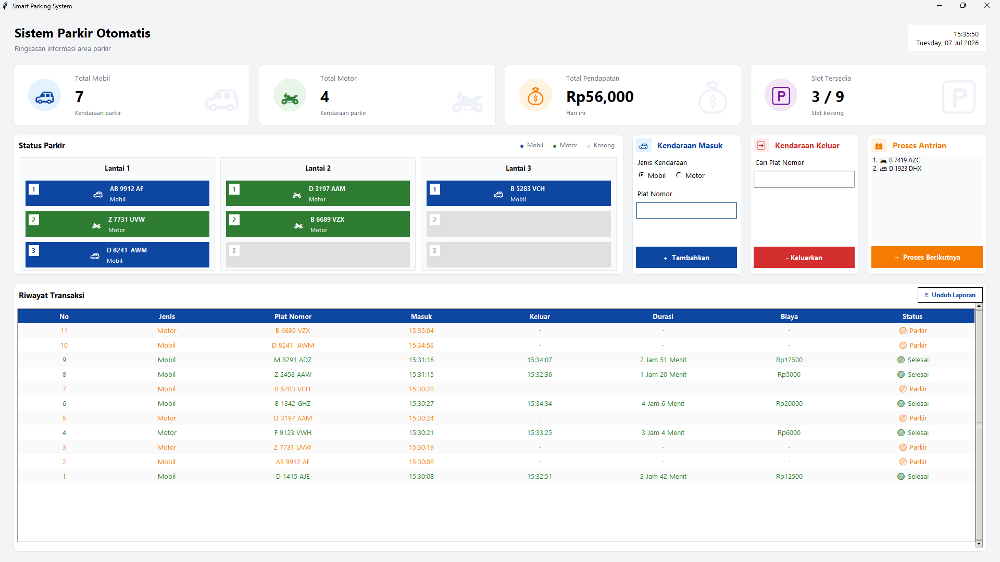

# Sistem Parkir Otomatis | Projek-UAS
Sistem Parkir Otomatis berbasis Python dengan antarmuka Tkinter yang menerapkan beberapa struktur data untuk mengelola proses parkir kendaraan secara efisien. Aplikasi ini mampu mengatur antrian kendaraan, slot parkir bertingkat, riwayat transaksi, hingga pembuatan laporan parkir.

## Fitur
 - Manajemen kendaraan masuk
 - Sistem antrian kendaraan sebelum parkir
 - Parkir bertingkat dengan kapasitas setiap lantai
 - Dashboard statistik secara real-time
 - Perhitungan biaya parkir otomatis
 - Riwayat transaksi kendaraan
 - Ekspor laporan parkir ke file .txt
 - Antarmuka GUI modern menggunakan Tkinter

## Struktur Data yang Digunakan
| Struktur Data | Implementasi | Fungsi |
|---------------|-------------|--------|
| Queue | `AntrianParkir` | Menyimpan kendaraan yang menunggu diproses |
| Stack | List Python | Memindahkan kendaraan yang menghalangi saat kendaraan keluar |
| Linked List | `LinkedListRiwayat` | Menyimpan riwayat transaksi parkir |
| List Bertingkat | `lantai_parkir` | Menyimpan kendaraan pada setiap lantai parkir |

## Teknologi
- Python 3
- Tkinter
- Time
- OS

## Cara Menjalankan
1. Clone repository
```bash
git clone https://github.com/Ryn104/Projek-UAS_StrukturData.git
```
2. Masuk ke folder project
```bash
cd Projek-UAS_StrukturData
```
3. Jalankan program
```bash
python Projek_SistemParkirOtomatis_UAS-StrukturData_Kelompok-6.py
```

## Alur Program
### Kendaraan Masuk
- Input jenis kendaraan dan plat nomor.
- Kendaraan masuk ke dalam antrian.
- Kendaraan diproses menuju slot parkir yang tersedia.
- Waktu masuk dicatat.
### Kendaraan Keluar
- Cari kendaraan berdasarkan plat nomor.
- Sistem menghitung durasi parkir.
- Sistem menghitung biaya parkir otomatis.
- Riwayat transaksi diperbarui.
### Laporan
- Seluruh transaksi dapat diunduh menjadi file `.txt`.

## Tarif Parkir
| Kendaraan | Tarif |
|-----------|-------|
| 🚗 Mobil | Rp5.000 / jam |
| 🏍️ Motor | Rp2.000 / jam |

**Ketentuan:**
- Kurang dari 1 jam dikenakan tarif minimum.
- Tambahan 50% tarif jika sisa waktu lebih dari 30 menit.

## Screenshot

